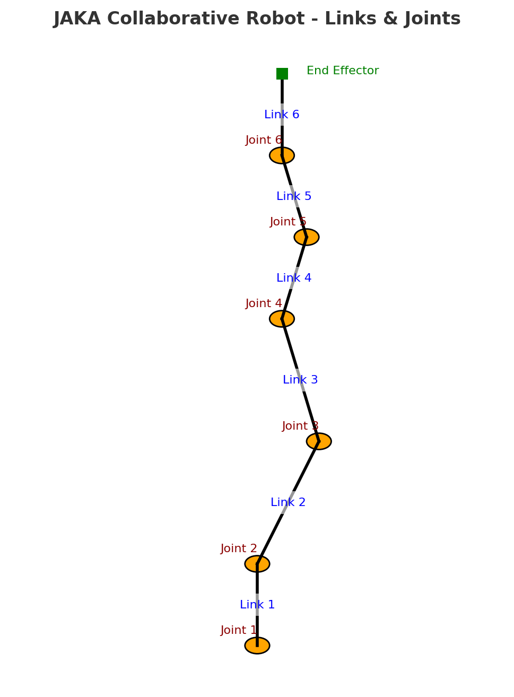
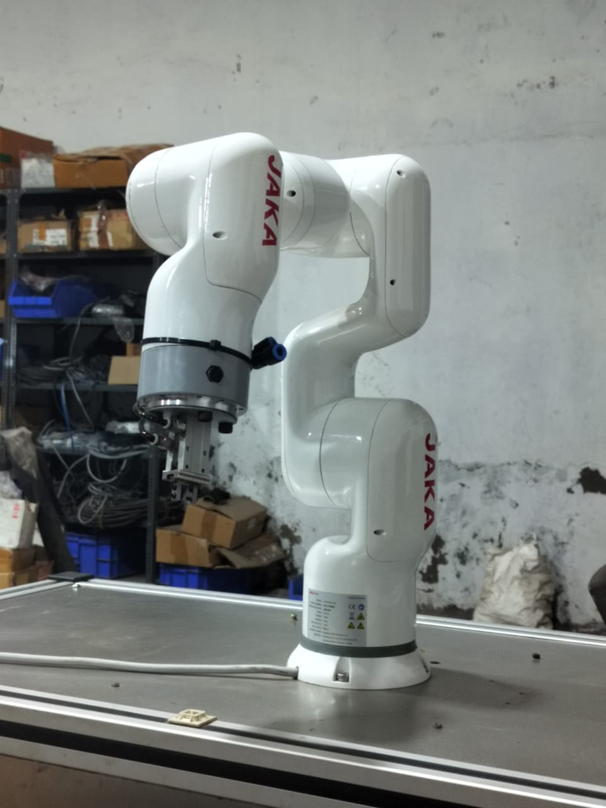
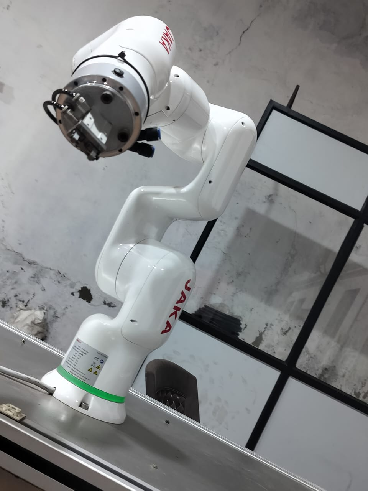
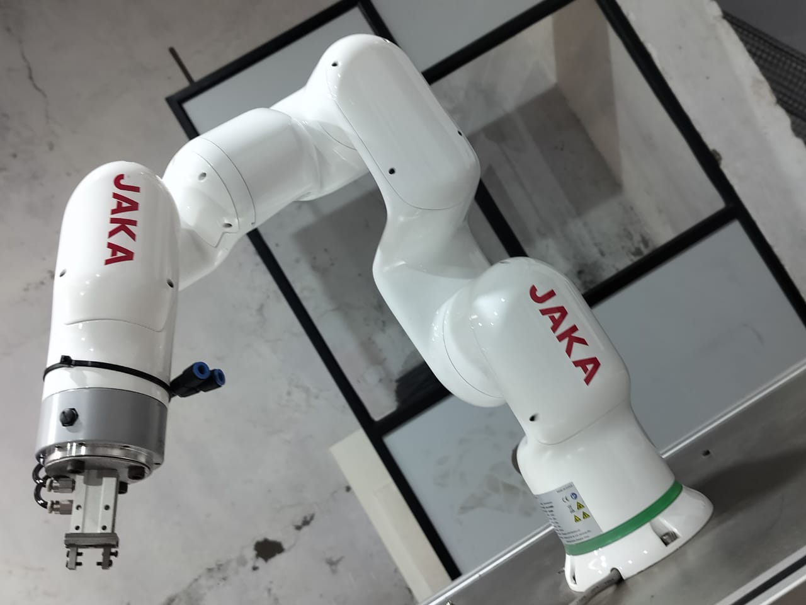

# 🤖 Robot Mechanics Demonstration using JAKA Collaborative Robot

## 📌 Project Overview

This project demonstrates **robot mechanics** concepts — focusing on **links**, **joints**, and **degrees of freedom (DOF)** — using a **JAKA collaborative robot**.
It connects theoretical mechanical concepts with real-world industrial robotics.

---

## 🎯 Objectives

* Identify and explain **links** and **joints** in an industrial robot.
* Show the motion of each joint and its corresponding link.
* Understand the mechanical structure that enables precise robotic movements.

---

## 🛠️ Tools & Technologies

* **Hardware:** JAKA Collaborative Robot
* **Programming Environment:** JAKA Robot Studio / Controller Interface
* **Motion Commands:** MoveJ (Joint Interpolation), MoveC (Circular Interpolation)

---

## 🔍 Understanding Robot Mechanics

### Total Links and Joints

* **Links:** 7 (including the fixed base as Link 0)
* **Joints:** 6 (all rotary/revolute type)
* **Configuration:** 6-DOF serial manipulator

### Links

* A **link** is a rigid structure between two joints.
* In the JAKA cobot:

  * Link 0 → Fixed base
  * Links 1–6 → Arm segments between joints
  * Link 7 → End-effector mounting

### Joints

* **Type:** Rotary (Revolute)
* **Function:** Allow rotation about a fixed axis between two links.
* **List of Joints:**

  1. Base rotation joint
  2. Shoulder rotation joint
  3. Elbow rotation joint
  4. Wrist pitch joint
  5. Wrist yaw joint
  6. Wrist roll joint

---

## 📸 Media

### 🖼 Links & Joints Diagram

![JAKA Links & Joints Diagram]

  
  

### 🎥 Demonstration Video

### 🖼 Real Robot Photo 

  
  
  

---

## 📚 Skills Learned

* Industrial robot structural analysis
* Identification of mechanical components (links & joints)
* Collaborative robot motion demonstration
* Practical understanding of 6-DOF robotic arms

---

## 🏷 Author

Khushi Singh
📌 Internship Project at Acrobot Technologies Pvt. Ltd.
